<picture>
  <source media="(prefers-color-scheme: dark)" srcset="./assets/workspace-dark.svg">
  <source media="(prefers-color-scheme: light)" srcset="./assets/workspace-light.svg">
  
</picture>

  
  
  

## `./stack --group-by=purpose`

<table>
  <tr>
    <th align="left">Área</th>
    <th align="left">Tecnologias</th>
  </tr>
  <tr>
    <td><strong>Backend</strong> onde as coisas acontecem</td>
    <td>
      &nbsp;
      &nbsp;
      &nbsp;
      &nbsp;
      &nbsp;
      
    </td>
  </tr>
  <tr>
    <td><strong>Dados</strong> estado com responsabilidade</td>
    <td>
      &nbsp;
      &nbsp;
      &nbsp;
      &nbsp;
      
    </td>
  </tr>
  <tr>
    <td><strong>Infra &amp; entrega</strong> da minha máquina até produção</td>
    <td>
      &nbsp;
      &nbsp;
      &nbsp;
      &nbsp;
      &nbsp;
      &nbsp;
      
    </td>
  </tr>
  <tr>
    <td><strong>Frontend</strong> quando a API precisa aparecer</td>
    <td>
      &nbsp;
      &nbsp;
      
    </td>
  </tr>
  <tr>
    <td><strong>Ferramentas</strong> debug, teste e construção</td>
    <td>
      &nbsp;
      &nbsp;
      &nbsp;
      &nbsp;
      
    </td>
  </tr>
</table>

## `githubctl metrics`

  
  

Feito entre APIs, containers e a curiosidade de entender o que acontece por baixo.

